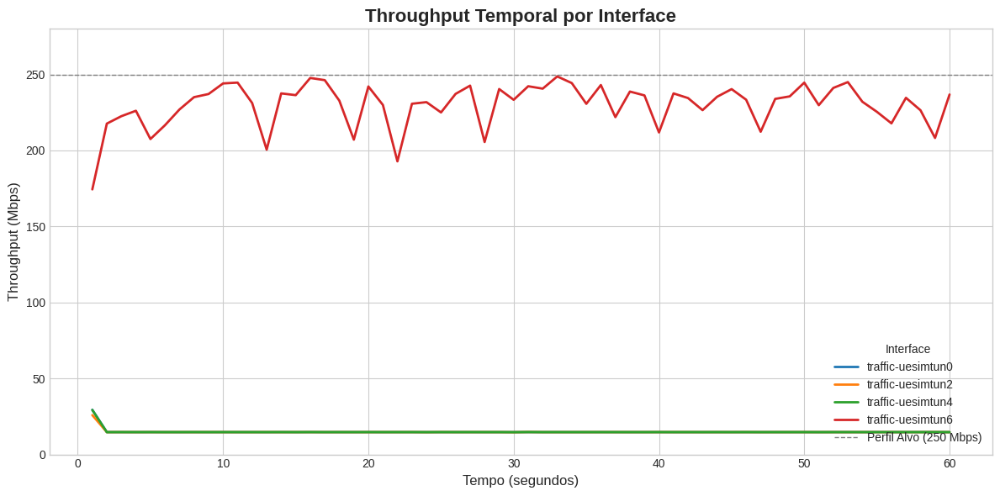
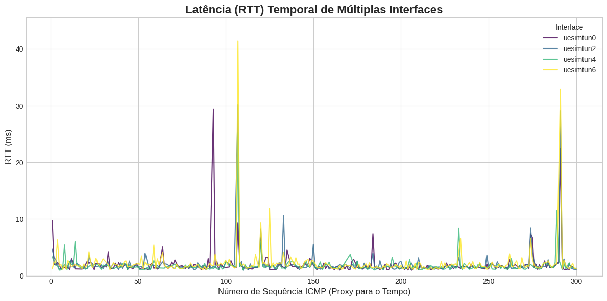
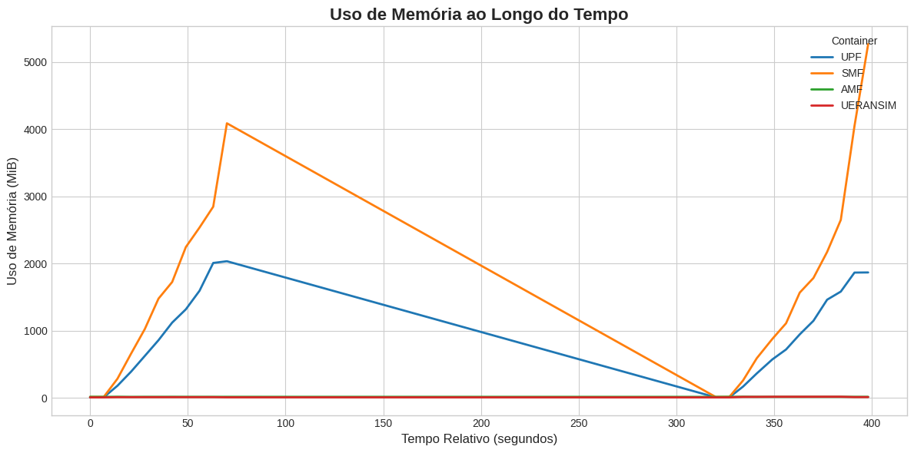
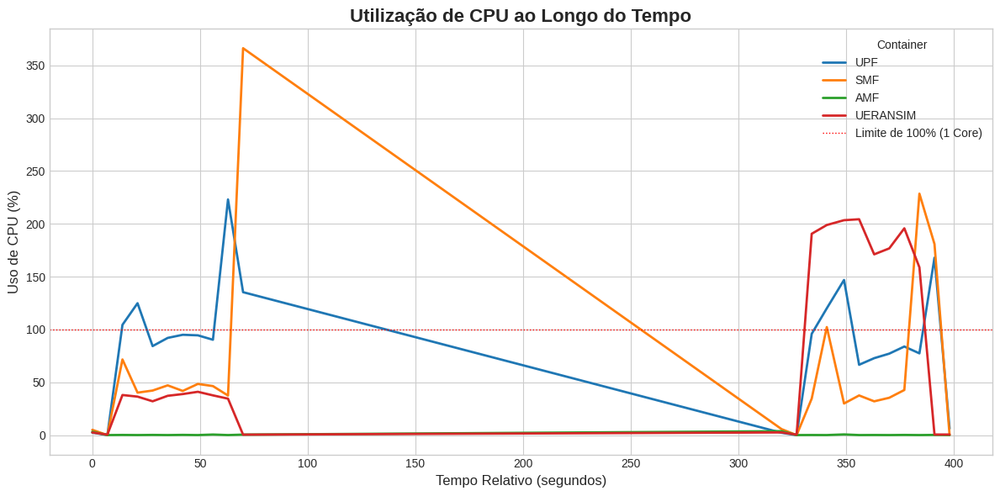

# QUALITY ON DEMAND (QOD) IMPLEMENTATION IN 5G NETWORKS WITH NEF, BASED ON FREE5GC

## Overview

The fifth generation of mobile networks (5G) relies on the Service-Based Architecture (SBA) paradigm, which is essential for supporting critical and context-sensitive applications, such as digital health systems. These applications require dynamic adaptation of Quality of Service (QoS) levels based on their immediate performance needs.

This project focuses on developing a software prototype for Quality on Demand (QoD) within a 5G Core network environment based on the open-source free5GC implementation. We designed and implemented a Network Exposure Function (NEF), which acts as a bridge, allowing external applications to dynamically request and enforce QoS parameters (like Guaranteed Bit Rate, Latency) within the network.

The solution adheres to the 3GPP SBA and aligns with the CAMARA Project standards for network API exposure.

## Objectives

### General objective

To develop a software prototype for the implementation of Quality on Demand (QoD) in 5G Core networks based on free5GC, using the NEF as the primary entry point for external applications.

### Specific objectives

- To design and implement an NEF in the Go language with support for RESTful APIs to handle QoD requests.

- To integrate the NEF with the actual Policy Control Function (PCF) of free5GC using the standardized Npcf_SMPolicyControl interface.

- To validate the application of QoS policies, including creation, renewal, and termination of QoD sessions.

- To evaluate relevant performance metrics such as throughput, latency, and jitter.

## Functional requirements

The NEF must:

- Receive a QoD request payload containing the device identifier (UE permanent ID), QoS parameters (5QI, GBR/MBR), and duration.

- Translate the request into a Standard Management Policy payload and transmit it to the PCF.

- Manage the full lifecycle of the QoD session.

## Architecture and components

The project is built upon the 5G SBA, integrating the developed NEF with existing Network Functions (NFs) in the free5GC core.


| Componente | Função | Base |
| :--- | :--- | :--- |
| **NEF (Network Exposure Function)** | Recebe requisições de Quality on Demand (QoD), valida parâmetros e as encaminha ao PCF. Atua como intermediário entre a aplicação externa e o núcleo 5G. | Desenvolvido em Go. |
| **PCF (Policy Control Function)** | Interpreta políticas externas (requisições QoD) e coordena com o SMF. | free5GC. |
| **SMF (Session Management Function)** | Gera regras de QoS (QER/PDR) e as instala no UPF.| free5GC. |
| **UPF (User Plane Function)** | Aplica as regras de QoS no tráfego (policing/shaping), garantindo os parâmetros de desempenho. | free5GC. |
| **UERANSIM** | Simula o User Equipment (UE) e o gNodeB, permitindo o tráfego de teste controlado. | Emulador RAN/UE. |

## Installation & usage

The project is designed to be deployed using Docker Compose for a streamlined setup of the 5G Core and the NEF.

### Prerequisites

1. Docker and Docker Compose installed.

2. A Linux environment (recommended) to run the free5GC and UERANSIM components.

### Step by step

#### With NEF local build

1. Build local NEF Docker image

```bash
cd NFs/nef && make docker
```

2. Run docker compose up

```bash
docker compose up
```

#### Without build

1. Run with docker compose

```bash
docker compose up
```

## Main results

This analysis compares network performance and resource consumption before and after implementing the Quality on Demand (QoD) feature in the free5gc Access and Mobility Management Function (AMF), with a target profile of 250 Mbps Uplink/Downlink.

For the tests, two VMs were utilized. The **main VM**, running the free5gc services, was configured with **8vCPU and 16GB of RAM**. The **secondary VM**, used for the iperf3 server, had a configuration of **2vCPU and 2GB of RAM**. Both VMs were located in the same region (**br-se-1c**), and data transfer occurred via a public IP over a **1Gbps** connection.

### 1. Network performance analysis (throughput and latency)

The results unequivocally validate the successful enforcement of the QoD policy, transitioning the connection from a limited state to a guaranteed quality service.

#### A. Throughput (iPerf test)



##### Key Finding

- High QoS maintains superior throughput: The traffic-uesimtun6 line (representing the highest-priority/most-guaranteed QoS) consistently shows the highest throughput throughout the test, outperforming the other curves.

- Throughput reduction over time: There is a noticeable downward trend in throughput for all QoS types as the test progresses (and/or as load increases), indicating possible resource exhaustion or system saturation.

- Performance differences between QoS levels: The throughput gap between the best performer (traffic-uesimtun6) and the worst performers (especially the lower curves) is significant, reinforcing the effectiveness of the QoS policy in prioritizing traffic.

- Low performance of lower QoS classes: The lower curves (such as uesimtun0, uesimtun1, etc.) show the lowest throughput, confirming that lower-priority traffic is the first to be negatively impacted under high-demand scenarios.

#### B. Packet Loss and Latency (Ping test - ICMP)


##### Key Finding

- Controlled packet loss: Packet loss for the UESIMTUN6 interface remains close to zero for most of the time, indicating high reliability for this specific type of traffic/tunnel.

- Loss spikes in other interfaces: Interfaces such as UESIMTUN0 and UESIMTUN1 show spikes in packet loss, suggesting that even higher-priority traffic can experience losses during certain stress conditions.

- Stability of the control function: Control Plane components such as the SMF and AMF maintain low and stable packet loss, which is crucial for network signaling and management.

- Impact at the beginning/middle of the test: The most significant packet loss peak occurs around time 150–200 (approximately), indicating a specific moment of overload in the network.



##### Key Finding

- Low and stable average latency across all interfaces:  
  For most of the test, all interfaces — including `uesimtun6` — show RTT values between 1 and 3 ms, indicating stable operation even under iperf3 traffic load.

- Occasional latency spikes:  
  Significant latency spikes are observed across all interfaces, reaching 30–40 ms at specific moments. These events are brief and non-persistent, representing microspikes typically caused by momentary congestion.

- QoS behavior (`uesimtun6`):  
  - Although `uesimtun6` has active QoS (250 Mbps guaranteed), it also experiences occasional spikes, indicating that QoS effectively provides *throughput guarantees* but does not completely eliminate RTT variability under heavy load.  
  - Even so, the overall pattern of `uesimtun6` remains equal to or slightly better than the interfaces without QoS, reinforcing that prioritization is active.

- No long-term degradation:  
  There is no evidence of progressive or sustained latency increase over time. This suggests that the system maintains its capacity to handle traffic without persistent saturation.

### 2. Resource Consumption Comparative Analysis

The resource monitoring reveals that the QoD logic in the NEF is highly efficient, while the improved traffic stability post-QoD surprisingly leads to a more efficient use of the data plane components.

### Memory Usage Over Time



- SMF shows the highest memory consumption:  
  SMF reaches peaks above 4 GiB, making it the component with the largest memory footprint during the test. Its usage rises quickly in the first half of the experiment, gradually decreases, and then spikes again near the end — indicating load sensitivity and potentially aggressive caching or buffer growth.

- UPF memory grows under load but remains stable:  
  UPF reaches around 2 GiB at peak load. After the traffic peak, it shows a progressive decrease, suggesting efficient memory release once the data-plane load is reduced.

- AMF and UERANSIM maintain very low memory usage:  
  Both components remain close to zero throughout the test, confirming that their memory demand is minimal under this specific workload.

- No signs of memory leakage:  
  Despite the fluctuations, memory returns to baseline levels after load removal, indicating no persistent growth or leak-like behavior.

### CPU Usage Over Time



- UPF and SMF are the most CPU-intensive components:  
  - UPF frequently operates near or above the 100% per-core limit, reaching peaks above 200%, which suggests multicore utilization under high throughput.  
  - SMF experiences an extreme spike up to ~370%, likely tied to control-plane bursts, session handling, or heavy signaling phases.

- UERANSIM presents noticeable CPU load during traffic execution:  
  CPU usage rises to 150–200% during test phases, reflecting user-plane traffic generation and ICMP probing activity.

- AMF remains near zero:  
  As expected for this workload, AMF does not show significant CPU demand, aligned with its signaling-focused role.

- Clear correlation between traffic phases and CPU spikes:  
  CPU usage across all components rises sharply during throughput-intensive windows (beginning and near the end of the test), with flat idle periods in the middle when no flows are active.
