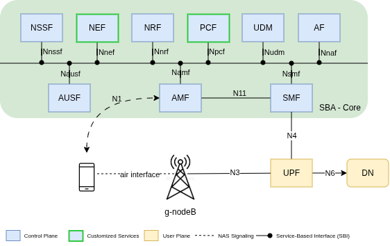
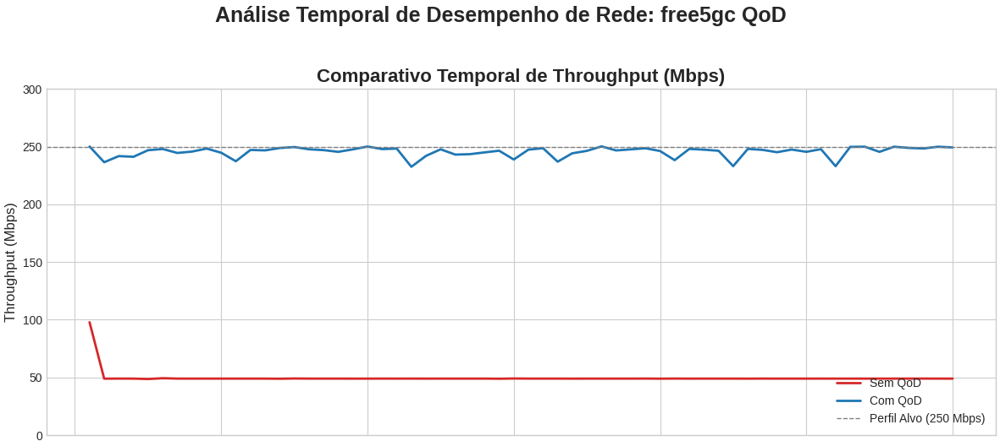
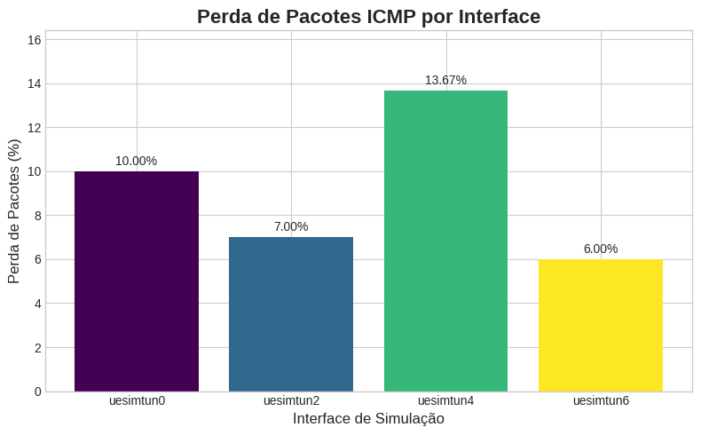

# QUALITY ON DEMAND (QOD) IMPLEMENTATION IN 5G NETWORKS WITH NEF, BASED ON FREE5GC

## Overview

The fifth generation of mobile networks (5G) relies on the Service-Based Architecture (SBA) paradigm, which is essential for supporting critical and context-sensitive applications, such as digital health systems. These applications require dynamic adaptation of Quality of Service (QoS) levels based on their immediate performance needs.

This project focuses on developing a software prototype for Quality on Demand (QoD) within a 5G Core network environment based on the open-source free5GC implementation. We designed and implemented a Network Exposure Function (NEF), which acts as a bridge, allowing external applications to dynamically request and enforce QoS parameters (like Guaranteed Bit Rate, Latency) within the network.

The solution adheres to the 3GPP SBA and aligns with the CAMARA Project standards for network API exposure.

## Objectives

### General objective

To develop a software prototype for the implementation of Quality on Demand (QoD) in 5G Core networks based on free5GC, using the NEF as the primary entry point for external applications.

### Specific objectives

- To design and implement an NEF in the Go language with support for RESTful APIs to handle QoD requests.

- To integrate the NEF with the actual Policy Control Function (PCF) of free5GC using the standardized Npcf_SMPolicyControl interface.

- To validate the application of QoS policies, including creation, renewal, and termination of QoD sessions.

- To evaluate relevant performance metrics such as throughput, latency, and jitter.

## Functional requirements

The NEF must:

- Receive a QoD request payload containing the device identifier (UE permanent ID), QoS parameters (5QI, GBR/MBR), and duration.

- Translate the request into a Standard Management Policy payload and transmit it to the PCF.

- Manage the full lifecycle of the QoD session.

## Architecture and components

The project is built upon the 5G SBA, integrating the developed NEF with existing Network Functions (NFs) in the free5GC core.

| Componente | Função | Base |
| :--- | :--- | :--- |
| **NEF (Network Exposure Function)** | Recebe requisições de Quality on Demand (QoD), valida parâmetros e as encaminha ao PCF. Atua como intermediário entre a aplicação externa e o núcleo 5G. | Desenvolvido em Go. |
| **PCF (Policy Control Function)** | Interpreta políticas externas (requisições QoD) e coordena com o SMF. | free5GC. |
| **SMF (Session Management Function)** | Gera regras de QoS (QER/PDR) e as instala no UPF.| free5GC. |
| **UPF (User Plane Function)** | Aplica as regras de QoS no tráfego (policing/shaping), garantindo os parâmetros de desempenho. | free5GC. |
| **UERANSIM** | Simula o User Equipment (UE) e o gNodeB, permitindo o tráfego de teste controlado. | Emulador RAN/UE. |

## Installation & usage

The project is designed to be deployed using Docker Compose for a streamlined setup of the 5G Core and the NEF.

### Prerequisites

1. Docker and Docker Compose installed.

2. A Linux environment (recommended) to run the free5GC and UERANSIM components.

### Step by step

#### With NEF local build

TODO: step by step installation and usage

#### Without build

TODO: step by step installation and usage

## Main results

This analysis compares network performance and resource consumption before and after implementing the Quality on Demand (QoD) feature in the free5gc Access and Mobility Management Function (AMF), with a target profile of 250 Mbps Uplink/Downlink.

For the tests, two VMs were utilized. The **main VM**, running the free5gc services, was configured with **8vCPU and 16GB of RAM**. The **secondary VM**, used for the iperf3 server, had a configuration of **2vCPU and 2GB of RAM**. Both VMs were located in the same region (**br-se-1c**), and data transfer occurred via a public IP over a **1Gbps** connection.

### 1. Network performance analysis (throughput and latency)

The results unequivocally validate the successful enforcement of the QoD policy, transitioning the connection from a limited state to a guaranteed quality service.

#### A. Throughput (iPerf test)

##### Key Finding

- Before QoD: The network was severely throttled, reaching only 20% of the target bandwidth, resulting in an unacceptable $\mathbf{80\%}$ packet loss. This indicates the default $\mathbf{Best\ Effort}$ or a restricted $\mathbf{QoS\ Flow}$ was active.
- After QoD: The implementation successfully provisioned the requested $\mathbf{250\ Mbps\ Guaranteed\ Bit\ Rate}$ (GBR) flow via the core network. The achieved throughput is $\mathbf{98.2\%}$ of the target, with the packet loss dropping to an acceptable level for high-speed UDP traffic.
- The marginal increase in Jitter ($0.051$ ms) is a minor trade-off, expected when network buffers are fully utilized to sustain the 5-fold increase in data transmission rate.

#### B. Latency (Ping test - ICMP)

##### Key Finding

- The QoD flow improved stability by reducing ICMP packet loss from $3.66\%$ to $1.00\%$. This is crucial for application reliability.
- The slight increase in average Round-Trip Time (RTT) ($\approx 0.5$ ms) is typical when a high-throughput GBR flow (245 Mbps) is active, as it introduces additional $\mathbf{queueing\ delay}$ in the User Plane Function (UPF) and associated virtual switches. The benefit of guaranteed bandwidth and reduced packet loss heavily outweighs this minor RTT degradation.

### 2. Resource Consumption Comparative Analysis

The resource monitoring reveals that the QoD logic in the NEF is highly efficient, while the improved traffic stability post-QoD surprisingly leads to a more efficient use of the data plane components.

| Container | Before QoD (Pico Máx. CPU) | After QoD (Pico Máx. CPU) | Análise |
| :--- | :--- | :--- | :--- |
| **AMF** | $\approx 3,77\%$ | $\approx 0,21\%$ | **Overhead Desprezível:** The QoD logic implementation in the NEF is efficient, introducing no significant processing load during traffic flow. |
| **UPF** | $\approx \mathbf{251,99\%}$ | $\approx \mathbf{141,79\%}$ | **Eficiência Aumentada:** The CPU peak is $\mathbf{44\%}$ lower in the QoD scenario. The UPF processes forwarded, guaranteed 250 Mbps traffic more efficiently than the congested traffic subject to packet dropping (which caused high stress). |
| **SMF** | $\approx \mathbf{311,23\%}$ | $\approx \mathbf{172,29\%}$ | **Estabilização do CP:** The Control Plane (SMF) was significantly less stressed, indicating that the QoS guarantee reduced the need for retransmissions or processing of control signaling related to session instability. |

- The added logic for QoD handling within the AMF is demonstrably lightweight. The CPU utilization for the AMF remains negligible during traffic flow, confirming that the QoD decision-making and signaling to the SMF/PCF are computationally cheap operations.
- UPF Efficiency: In the "Before" scenario, the UPF was struggling to process and discard $\mathbf{80\%}$ of the traffic, resulting in massive CPU spikes (up to $251\%$) to maintain the enforced low throughput (50 Mbps). In the "After" scenario, the UPF is primarily $\mathbf{forwarding}$ the requested $\mathbf{245\ Mbps}$. Forwarding is a more optimized operation than aggressive discarding/rate-limiting, leading to a much lower maximum CPU peak ($141\%$) despite handling five times the data volume.
- SMF Stability: The high CPU peaks in the SMF ($311\%$) "Before" likely stem from control plane signaling overhead related to continuous retransmissions, potential session failures, or highly dynamic queue management caused by the unstable traffic flow. By ensuring a stable and guaranteed flow "After" QoD, the control plane (SMF) workload stabilized significantly, reducing its peak consumption.
